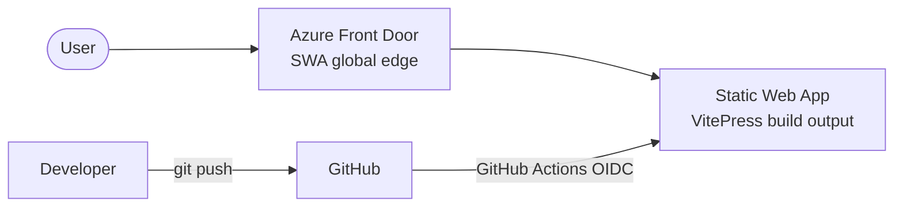

# Architecture

There is one resource: the Static Web App. The browser hits SWA's global edge, which serves the pre-built VitePress site (HTML + hashed JS/CSS) directly from the CDN — no origin, no cold starts.

GitHub Actions builds the site on every push and uploads the `docs/.vitepress/dist` folder. Pull requests get an isolated preview environment on a unique URL; closing the PR tears it down automatically.
